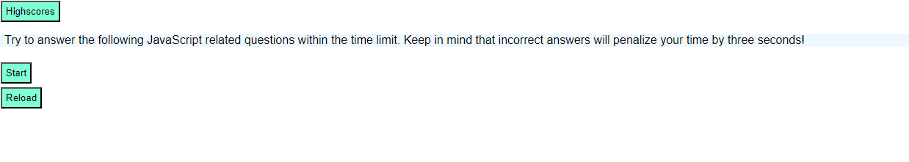

# Java Script Quiz

## Description
The goal of this Java Script Quiz is to demonstrate what I have learned about JavaScript and Web APIs. These new skills must be used along with previous lessons in HTML and CSS to build the structure and design of the web page. 

### Specific Objectives:
1. The user clicks the start button, a timer starts, and the user is presented with a question
2. If the user answers the question correctly, they are presented with another question
3. If the user answers the question incorrectly, time is subtracted from the clock
4. When all of the questions are answered or the timer reaches 0, the game is over
5. When the game is over the user can save their initials and their score
6. User also has the option to view stored high scores

## Installation
No installation is needed to use this resource, simply follow the link to the webpage

## Screenshot

## Link
https://ms-meredith-mcd.github.io/JavaScriptQuiz/